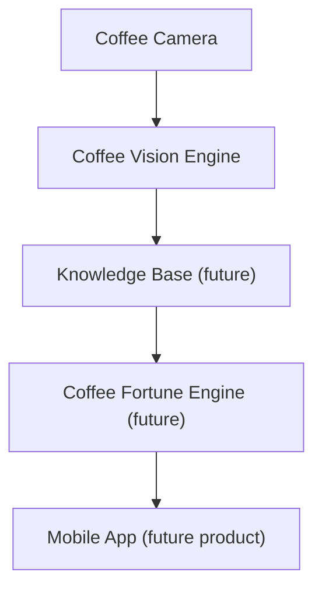
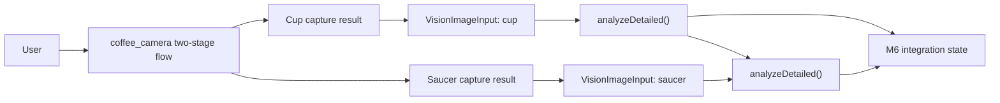
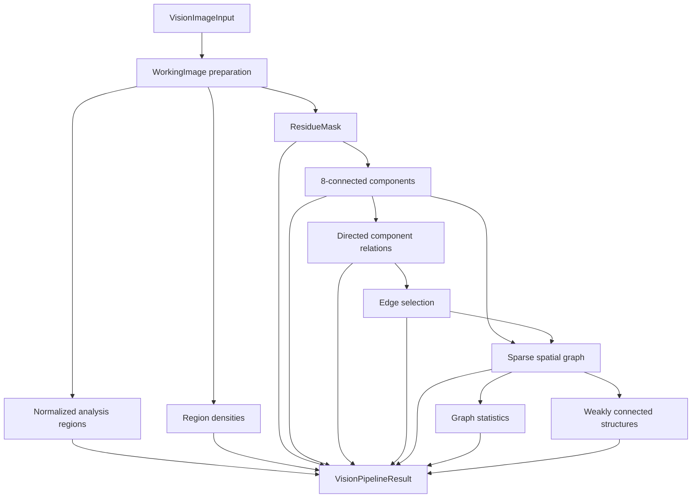
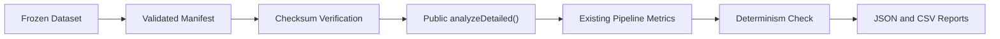
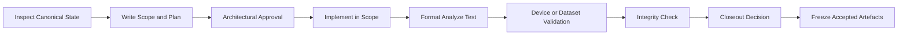

# Atlas Engineering Handbook

**Version:** 1.0  
**Document type:** Authoritative Software Engineering Handbook  
**Canonical format:** Markdown  
**Platform:** Coffee Platform / Atlas  
**Current engineering baseline:** Coffee Vision Engine v0.6 Atlas  
**Milestone baseline:** M5A STABLE, M5B STABLE, M6 Android STABLE  
**Document status:** Initial controlled edition  
**Last verified:** 2026-07-22  

> [!IMPORTANT]
> This handbook is subordinate to the **Coffee Platform Constitution v1.0**. If this handbook, a milestone plan, an implementation proposal, or an automated tool conflicts with the Constitution, the Constitution wins. The conflict must be reported and founder approval obtained before implementation.

---

## Document Control

| Field | Value |
|---|---|
| Canonical source | `ATLAS_ENGINEERING_HANDBOOK.md` |
| Canonical location | Atlas platform workspace root, outside frozen production packages |
| Intended readers | Maintainers, contributors, reviewers, release owners, and AI-assisted development agents |
| Change model | Reviewed, version-controlled, architecture-governed |
| Target rendered length | 50–70 pages |
| Absolute rendered limit | 80 pages |
| Detailed API documentation | Separate future API reference |
| Detailed algorithms | Separate future algorithm notes |
| Validation run records | Existing milestone report directories |
| Dataset records | External dataset manifests, freeze records, and consent records |
| ADR register | Requires Architectural Review before a canonical path is assigned |

### Revision History

| Version | Date | Status | Summary |
|---|---:|---|---|
| 1.0 | 2026-07-22 | Initial controlled edition | Establishes the engineering rules implemented and accepted through Atlas M6. |

### Normative Language

The words **MUST**, **MUST NOT**, **SHOULD**, **SHOULD NOT**, and **MAY** are normative.

- **MUST / MUST NOT** indicate a non-negotiable engineering rule.
- **SHOULD / SHOULD NOT** indicate the default decision unless an ADR records a justified exception.
- **MAY** indicates an optional choice that stays within existing boundaries.
- **Requires Architectural Review** means that the project history does not yet establish a safe default. No assumption may silently become policy.

### Authority Order

When two sources disagree, apply this order:

| Rank | Source |
|---:|---|
| 1 | Coffee Platform Constitution v1.0 |
| 2 | Explicit founder decisions and approved Decision Governance records |
| 3 | This handbook |
| 4 | Accepted ADRs, milestone plans, and STABLE closeout records that do not conflict with ranks 1–3 |
| 5 | Package documentation and code comments |
| 6 | Implementation convenience |

> [!CAUTION]
> Code is evidence of the current implementation, but accidental code behavior does not automatically become architecture. A conflict between code and a higher authority must be investigated, not normalized silently.

---

## Table of Contents

1. [Project Vision](#1-project-vision)
2. [Atlas Engineering Principles](#2-atlas-engineering-principles)
3. [Architecture Overview](#3-architecture-overview)
4. [Repository Structure](#4-repository-structure)
5. [Package Responsibilities](#5-package-responsibilities)
6. [Coding Standards](#6-coding-standards)
7. [Validation Philosophy](#7-validation-philosophy)
8. [Dataset Rules](#8-dataset-rules)
9. [Testing Policy](#9-testing-policy)
10. [Public API Policy](#10-public-api-policy)
11. [Milestone Workflow](#11-milestone-workflow)
12. [Architecture Decision Records](#12-architecture-decision-records)
13. [AI Collaboration Rules](#13-ai-collaboration-rules)
14. [Release Process](#14-release-process)
15. [Future Expansion Rules](#15-future-expansion-rules)
16. [Appendix A: Milestone and Freeze Matrix](#appendix-a-milestone-and-freeze-matrix)
17. [Appendix B: Governance Escalation Template](#appendix-b-governance-escalation-template)
18. [Appendix C: Glossary](#appendix-c-glossary)
19. [Appendix D: Acronyms](#appendix-d-acronyms)
20. [Appendix E: Document Register](#appendix-e-document-register)

### Figure Index

| Figure | Title | Location |
|---|---|---|
| 1 | Constitutional module chain | §3.2 |
| 2 | Implemented M6 data flow | §3.3 |
| 3 | Coffee Vision detailed pipeline | §3.4 |
| 4 | Validation pipeline boundary | §7.2 |
| 5 | Standard milestone lifecycle | §11.2 |
| 6 | Graph-analysis layering | §15.4 |

### Table Index

| Table | Title | Location |
|---|---|---|
| 1 | Document control | Front matter |
| 2 | Revision history | Front matter |
| 3 | Authority order | Front matter |
| 4 | Layer responsibilities | §3.5 |
| 5 | Workspace structure | §4.2 |
| 6 | Public package responsibility matrix | §5.2 |
| 7 | Validation exit codes | §7.5 |
| 8 | Manifest contract | §8.4 |
| 9 | Test layers | §9.2 |
| 10 | Milestone states | §11.7 |
| 11 | Release categories | §14.2 |
| 12 | Current freeze matrix | Appendix A |
| 13 | Glossary | Appendix C |
| 14 | Acronyms | Appendix D |
| 15 | Authority and reference documents | Appendix E.1 |
| 16 | Editorial page budget | Appendix E.4 |

### How to Use This Handbook

This is a decision and maintenance reference. It is not a tutorial and does not replace source-level documentation.

- Start with Chapters 1–3 before proposing architecture.
- Use Chapters 4–6 when changing code or package boundaries.
- Use Chapters 7–9 when creating evidence.
- Use Chapters 10–12 before changing a public contract or accepted decision.
- Apply Chapter 13 to all AI-assisted work.
- Use Chapter 14 for release and closeout.
- Check Chapter 15 before beginning a new product capability.

Every chapter answers three practical questions:

1. Why does the rule exist?
2. What is mandatory?
3. What must never be done?

Detailed class lists, complete APIs, full algorithms, test implementations, dataset contents, and full validation reports are deliberately excluded.

---

# 1. Project Vision

## 1.1 Purpose

Atlas exists to support a trustworthy coffee-reading platform grounded in real image evidence. The platform is not designed to generate random fortune text. It first captures usable images, then produces explainable observations, and only in a later independent layer may those observations be interpreted.

The Constitution states the governing sequence:

```text
Capture reliable evidence
→ Observe and organize image-derived facts
→ Interpret through an independent rule-governed layer
```

The purpose of this separation is trust. A user-facing conclusion must remain traceable to captured evidence and explicit processing stages.

## 1.2 Mission Boundary

Atlas currently provides:

- an embeddable Flutter camera package for cup and saucer capture;
- an independent pure Dart Vision Engine;
- deterministic preparation, residue, component, relation, graph, and connected-structure foundations;
- validation and reporting tooling;
- frozen real-dataset baselines;
- a standalone M6 integration application proving camera-to-vision orchestration on Android.

Atlas does not currently provide:

- production symbol recognition;
- a Knowledge Base;
- a Fortune Engine;
- user-facing fortune interpretation;
- an AI decision layer;
- a server analysis requirement;
- production confidence scoring in the detailed pipeline.

> [!NOTE]
> `VisionObservation.confidence` remains `0.0` in the honest placeholder `analyze()` contract. `VisionPipelineResult` does not claim symbol, fortune, or production confidence output.

## 1.3 Why This Boundary Exists

Camera quality, image observation, semantic interpretation, and product presentation change for different reasons. Combining them would make failures difficult to explain, testing expensive, and future evolution risky.

The boundary allows:

- camera improvements without changing interpretation;
- Vision changes without changing capture behavior;
- dataset validation without product UI coupling;
- future Fortune logic without contaminating image evidence;
- offline operation before optional server assistance;
- audit of each decision stage.

## 1.4 Mandatory Vision

All Atlas work MUST preserve these outcomes:

- Captured images remain the factual input.
- Camera and Vision remain independently testable.
- Cup and saucer remain distinct surfaces.
- Vision output remains deterministic and explainable unless a later approved layer explicitly states otherwise.
- AI remains optional and cannot become the sole decision maker.
- New capabilities remain modular and replaceable.
- Cost reduction cannot silently reduce evidence quality.

## 1.5 Prohibited Direction

Atlas MUST NOT become:

- a random text generator presented as image analysis;
- a camera package that interprets symbols or fortunes;
- a Vision package that contains user-facing fortune prose;
- a pipeline whose conclusions cannot be related to observable inputs;
- a server-only system without an explicitly approved architectural change;
- a collection of tightly coupled packages that must be changed together.

## 1.6 Current Baseline

The accepted baseline is:

- Coffee Vision Engine v0.6 Atlas;
- M5A Validation & Reporting: STABLE;
- M5B Real Dataset Baseline: STABLE;
- M6 Camera Integration: Android STABLE;
- iOS physical M6 validation: blocked pending macOS/Xcode and not represented as completed.

Frozen components may be reopened only through the governance process in Chapters 11 and 12.

---

# 2. Atlas Engineering Principles

## 2.1 Constitutional Principles

The Constitution establishes the following non-negotiable direction:

1. Vision and Fortune are separate.
2. Camera produces quality data only.
3. Vision observes and must be explainable.
4. Symbols, when implemented, must be evidence-based.
5. Future symbols are structured objects, not labels alone.
6. The future Knowledge Base is data, not hard-coded knowledge.
7. Relationships matter; future interpretation is graph-aware.
8. Geometry precedes naming.
9. Analysis is region-based.
10. Cup and saucer are independent analyses.
11. A Rule Engine remains present; AI is not the only decision maker.
12. AI is optional and offline analysis remains possible.
13. Cost optimization follows quality preservation.
14. Explainability has priority.
15. Platform modules remain independent.
16. Early releases are small and stable.
17. Features must improve trust, explainability, cost discipline, long-term maintainability, and modularity.

These are product and architecture constraints, not optional style preferences.

## 2.2 Determinism

**Why:** Validation, baselines, regression analysis, and audit require repeatable output.

**Mandatory:**

- Identical inputs and configuration MUST produce equal results.
- Collection ordering MUST be explicit and stable.
- Tie-breaking MUST be deterministic.
- Validation MUST record non-deterministic outcomes instead of hiding them.
- Randomness MUST NOT be introduced without an approved, testable contract.

**Never:**

- Do not depend on hash-map iteration order as a business rule.
- Do not generate fake observations to make a demo appear complete.
- Do not suppress a non-deterministic record from a baseline.

## 2.3 Explainability

**Why:** The platform promise depends on showing why a result exists.

**Mandatory:**

- Every computation stage SHOULD expose a bounded, inspectable result model.
- Thresholds and geometry MUST be defined in code and tests.
- A result MUST not claim semantics beyond its actual computation.
- Errors MUST identify the failing stage without leaking sensitive bytes or paths.

**Never:**

- Do not call a density value a symbol or fortune.
- Do not call orchestration a new analysis algorithm.
- Do not use confidence language when no production confidence metric exists.

## 2.4 Immutability

**Why:** Shared image and graph results pass through multiple layers. Mutable data would make equality, determinism, and ownership unclear.

**Mandatory:**

- Public result models MUST be immutable.
- Input and output byte collections MUST be defensively protected.
- Public lists and maps MUST be unmodifiable.
- Equality and `hashCode` MUST be consistent where value comparison is part of the project pattern.

**Never:**

- Do not expose an internal mutable pixel buffer.
- Do not mutate a graph while analyzing it.
- Do not change caller-owned image bytes.

## 2.5 Minimal Architecture

**Why:** Premature layers increase maintenance cost and obscure real requirements.

**Mandatory:**

- Add the smallest abstraction that satisfies a demonstrated need.
- Keep internal helpers internal.
- Prefer existing package patterns over new frameworks.
- Add dependencies only when a small, focused implementation cannot reliably solve the problem.

**Never:**

- Do not add repositories, service locators, dependency-injection frameworks, sessions, caches, workers, or isolates without measured need and approval.
- Do not create empty interfaces for hypothetical implementations.
- Do not expand public API for internal convenience.

## 2.6 Additive Evolution

**Why:** Camera and Vision packages are embedded by other applications and validated against frozen baselines.

**Mandatory:**

- Existing public constructors and behavior MUST remain compatible unless a breaking change is approved.
- New capabilities SHOULD be additive.
- Compatibility aliases MUST remain until an approved deprecation removes them.
- New orchestration MUST reuse existing stages rather than silently replacing them.

**Never:**

- Do not repurpose an existing field with a new meaning.
- Do not make an optional workflow mandatory through an old API.
- Do not remove old behavior merely because a new flow exists.

## 2.7 Organization Is Not Analysis

Atlas established this explicit rule for graphs:

```text
VisionSpatialGraph = Organization Layer
Graph analyzers       = Analysis Layer
```

The graph stores verified components, relations, and adjacency. It does not infer clusters, patterns, symbols, or fortunes. Analysis consumes the graph through separate services and immutable results.

This principle generalizes: data containers organize; analyzers compute; interpreters assign meaning.

## 2.8 Frozen Means Frozen

**Why:** A baseline is useful only when its inputs and production behavior remain stable.

**Mandatory:**

- A STABLE milestone MUST identify frozen packages, algorithms, thresholds, configs, datasets, manifests, and reports.
- Reopening MUST state the exact reason and impact.
- Pre/post file inventories SHOULD be used when validating no-change work.

**Never:**

- Do not tune a threshold while evaluating a baseline.
- Do not rewrite a report to improve an outcome.
- Do not fix a package merely to simplify an integration demo.

## 2.9 Decision Governance

No AI agent, developer, or automated tool may directly implement an architectural change that conflicts with the Constitution.

The required response is:

1. Identify the conflicting principle.
2. Explain the technical rationale for the proposal.
3. List the risks and affected frozen surfaces.
4. Ask whether the Constitution or proposal should change.
5. Wait for founder approval.

Silence is not approval. Convenience is not an exception.

---

# 3. Architecture Overview

## 3.1 Purpose

The architecture separates evidence acquisition, image observation, future knowledge, future interpretation, and product presentation. Each module has one direction of dependency and one reason to change.

## 3.2 Constitutional Module Chain



**Figure 1. Constitutional module chain.** Future modules are shown because the Constitution defines them; they are not implemented by the current Vision pipeline.

Dependency flow MUST move downward. Camera MUST NOT depend on Vision, Fortune, or product interpretation. Vision MUST NOT depend on Camera UI or Fortune.

## 3.3 Implemented M6 Data Flow



**Figure 2. Implemented M6 data flow.** The accepted sequence is:

```text
Cup Capture → Saucer Capture → Cup Analysis → Saucer Analysis
```

The M6 demo is an integration validator, not the production product application. It proves:

- local path integration without copying package source;
- mandatory two-stage capture;
- sequential cup then saucer analysis;
- separate states and durations;
- retention of original capture results and complete pipeline results;
- duplicate-operation prevention;
- lifecycle and resource cleanup.

## 3.4 Coffee Vision Detailed Pipeline



**Figure 3. Coffee Vision detailed pipeline.** `analyzeDetailed()` orchestrates existing stages. It does not add symbol recognition, fortune interpretation, production confidence, or AI.

The current Working Image contract uses:

- JPEG and PNG input support;
- source metadata preservation;
- a default `512 × 512` working resolution;
- aspect-ratio-preserving fit with adaptive padding;
- normalized `contentRect` excluding padding from content analysis.

The current residue classification uses one shared internal implementation so mask and density rules do not diverge. Algorithm details belong in a future Algorithm Reference, not this handbook.

## 3.5 Layer Responsibility Matrix

| Layer | Owns | Does not own |
|---|---|---|
| Coffee Camera | Permission, preview, guidance, local capture, crop, retake, approval, temporary-file lifecycle | Vision pipeline, symbols, fortune, Knowledge Base |
| Coffee Vision | Image preparation, normalized geometry, density, residue mask, components, relations, graph organization and graph analysis foundations | Camera lifecycle, UI, fortune prose, AI decisions |
| Validation | Manifest parsing, sequential runs, determinism comparison, metrics extraction, JSON/CSV reports | Production algorithm changes, threshold tuning, dataset mutation |
| Dataset records | Image inventory, ownership, consent, checksums, freeze identity | Production code, result interpretation |
| M6 demo | Package orchestration and physical integration evidence | New camera behavior, new Vision algorithm, public platform API |
| Future Knowledge Base | Data-driven symbol knowledge | Image capture or raw image processing |
| Future Fortune Engine | Rule-governed interpretation | Camera and Vision implementation |

## 3.6 Cup and Saucer Independence

Cup and saucer MUST retain separate:

- capture steps;
- image inputs;
- analysis states;
- `VisionSurfaceType` values;
- pipeline results;
- failure handling;
- timing observations.

A successful cup result MUST remain inspectable if saucer analysis fails. Saucer retry MUST NOT recompute cup unless the user explicitly begins a new capture or the cup result is invalidated.

## 3.7 Sync and Async Boundaries

Public async contracts were chosen where future execution may move off-isolate without breaking callers. An implementation MAY remain synchronous internally while returning a `Future`.

This choice does not authorize adding isolates, workers, sessions, or caches. Those require measured performance evidence and a separate architectural decision.

## 3.8 Ownership Boundaries

Image ownership changes at explicit approval points:

- Before approval, the camera package owns temporary capture and crop files.
- Retake and cancellation delete package-owned files best-effort.
- After final approval, ownership transfers to the caller.
- The integration layer may retain approved files for preview and retry.
- Superseded files are cleaned without changing successful visible state.

Raw image bytes MUST NOT be printed to logs.

---

# 4. Repository Structure

## 4.1 Workspace Model

Atlas currently uses sibling packages and milestone applications rather than one package containing every responsibility.

The logical workspace is:

```text
Atlas workspace root/
├── ATLAS_ENGINEERING_HANDBOOK.md
├── coffee_vision/
├── coffee_vision_demo/
├── atlas_m5b_dataset/          # repository-external/local dataset area
├── atlas_m6_camera_vision_demo/
└── coffee_camera/              # sibling package; local path may vary
```

Absolute developer-machine paths are not architecture. Local path dependencies MAY vary by workstation, while dependency direction and package boundaries MUST remain unchanged.

## 4.2 Workspace Structure

| Area | Classification | Change policy |
|---|---|---|
| `coffee_camera/lib` | Production Flutter package | Frozen after accepted milestone unless explicitly reopened |
| `coffee_camera/test` | Camera package verification | Must evolve with approved behavior changes |
| `coffee_vision/lib` | Production pure Dart package | Frozen at accepted baseline unless explicitly reopened |
| `coffee_vision/test` | Vision verification | Existing tests must be preserved |
| `coffee_vision/tool/validation` | Development validation tooling | Frozen at M5A baseline |
| `coffee_vision/validation` | Schemas, synthetic manifest, baseline reports | Existing frozen artefacts are immutable |
| `atlas_m5b_dataset` | Local external dataset | Governed by manifest, consent, freeze, and checksums |
| `atlas_m6_camera_vision_demo` | Standalone integration validator | Not a production application |
| `build`, `.dart_tool` | Generated | Excluded from source integrity inventories |

## 4.3 Production Versus Validation

Production code belongs under package `lib/`. Development runners belong under `tool/`. Validation schemas and reports belong under `validation/`. Real dataset images remain outside the production package.

Validation-only types MUST NOT be exported from `coffee_vision.dart`. Demo-only controllers MUST NOT be moved into either production package solely for reuse.

## 4.4 Canonical Working Tree

Before implementation or verification, the agent or developer MUST identify the canonical directory. Reports from staging folders, copied packages, or another working tree MUST NOT be presented as canonical results.

Canonical verification includes:

- absolute path;
- expected package name from `pubspec.yaml`;
- expected source files;
- test count and command working directory;
- pre/post hash inventory for no-change milestones when required.

## 4.5 Generated Artefacts

Generated build directories MAY be cleaned to resolve toolchain state. Such cleanup is not a source change, but it MUST be reported when it affects verification steps.

Generated artefacts MUST NOT be used as the only record of an architectural decision.

## 4.6 Prohibited Repository Practices

- Do not copy `coffee_vision` source into a Flutter demo.
- Do not copy `coffee_camera` source into an integration application.
- Do not place real datasets under production package source trees.
- Do not edit frozen baseline JSON/CSV to make a run look successful.
- Do not create a second package with the same canonical name.
- Do not treat a staging directory as the production package.
- Do not commit secrets, raw consent evidence, or sensitive images to public storage.

---

# 5. Package Responsibilities

## 5.1 Why Package Boundaries Matter

Packages are trust boundaries. Each package must remain usable and testable without importing implementation details from another layer.

The direction is:

```text
Application or integration layer
├── depends on coffee_camera
└── depends on coffee_vision

coffee_camera ─X→ coffee_vision
coffee_vision ─X→ coffee_camera
```

The integration application coordinates both. Neither production package depends on the other.

## 5.2 Responsibility Matrix

| Package or area | Mandatory responsibility | Forbidden responsibility |
|---|---|---|
| `coffee_camera` | Produce approved cup/saucer image results and manage camera resources | Run Coffee Vision or interpret results |
| `coffee_vision` | Consume standard image bytes and return immutable observations | Depend on Flutter, camera plugins, UI, or fortune logic |
| Validation runner | Exercise `analyzeDetailed()` deterministically and report existing metrics | Change production behavior or calculate alternative metrics |
| M6 integration demo | Sequence capture and public Vision calls | Become a shared adapter package without approval |
| Future Knowledge Base | Store data-driven knowledge | Become hard-coded symbol logic inside Vision |
| Future Fortune Engine | Interpret approved observations using rules | Become part of Camera or Vision |

## 5.3 Coffee Camera

`coffee_camera` is an embeddable Flutter package. Its public surface includes configuration, capture result models, detector injection points, screen widgets, and navigation helpers.

Mandatory behavior includes:

- rear-camera-first capture with audio disabled;
- permission and lifecycle handling;
- portrait camera experience;
- cup and optional saucer steps;
- preview, retake, approval, and cancellation;
- manual capture availability;
- cup automatic capture only under established readiness rules;
- separate cup and saucer analysis state;
- crop paths that preserve original capture paths;
- cleanup of package-owned temporary files.

The existing compatibility contracts remain:

- `showCoffeeCamera()` returns one `CameraCaptureResult?` and rejects a required-saucer config;
- `showCoffeeCameraFlow()` returns `CoffeeCameraCaptureResult?` for the two-stage flow;
- `requireSaucerCapture` defaults to `false`;
- existing detector injection points remain available.

Camera detection, effects, and auto-crop are capture-quality capabilities. They MUST NOT be described as Coffee Vision semantic analysis.

## 5.4 Coffee Vision

`coffee_vision` is a pure Dart package. It has no Flutter SDK, camera, `dart:ui`, server, or platform dependency.

Its production dependency is the pure Dart `image` package. `crypto` is a development dependency used by validation tooling.

Mandatory behavior includes:

- JPEG and PNG validation;
- immutable input and result models;
- Working Image preparation;
- normalized coordinate infrastructure;
- deterministic region, density, residue, component, relation, edge-selection, graph, statistics, and connected-structure stages;
- public `analyzeDetailed()` orchestration;
- preservation of the honest placeholder `analyze()` contract.

The package MUST NOT:

- import `coffee_camera`;
- import Flutter or `dart:ui`;
- generate symbols or fortune text;
- imply that graph structure is a fortune interpretation;
- add server or AI behavior without a future approved milestone.

## 5.5 Validation Tooling

Validation is intentionally outside `lib/`. It consumes only the public barrel and `analyzeDetailed()`.

It MUST:

- parse an exact manifest schema;
- verify file checksums;
- process enabled entries sequentially in manifest order;
- repeat analysis deterministically;
- preserve failures and non-deterministic records;
- extract metrics from existing pipeline results;
- emit stable JSON and CSV reports;
- avoid timestamps and machine-specific noise in deterministic report content unless a separate closeout record explicitly needs execution time.

It MUST NOT:

- import `lib/src` directly;
- tune thresholds;
- reimplement metrics;
- skip inconvenient enabled records;
- change dataset files.

## 5.6 Milestone Applications

`coffee_vision_demo` and `atlas_m6_camera_vision_demo` exist for development validation. They are not production product shells.

Milestone applications SHOULD remain:

- single-purpose;
- dependency-light;
- explicit about loading, success, and failure states;
- isolated from production package ownership;
- disposable without losing production capability.

They MUST NOT become an excuse to add demo-specific APIs to a frozen package.

## 5.7 Future Packages

The Constitution reserves boundaries for a Knowledge Base, Fortune Engine, and mobile product application. Their exact repositories, APIs, and release lifecycle **Require Architectural Review**.

No current package may preemptively absorb those responsibilities.

# 6. Coding Standards

## 6.1 Purpose

These standards keep Atlas deterministic, reviewable, and maintainable across Dart, Flutter, validation tools, and milestone applications. They exist to protect architectural boundaries as much as code quality.

## 6.2 Mandatory Baseline

All production code MUST:

- use null-safe Dart;
- pass the repository's formatter, analyzer, and tests;
- keep classes focused on one responsibility;
- prefer explicit validation over implicit fallback;
- preserve deterministic behavior for the same input and configuration;
- follow the existing package's naming and file layout;
- add only dependencies justified by the approved scope.

Code MUST NOT be merged solely because it works on one device or one fixture.

## 6.3 Package Boundary Discipline

Pure Dart packages MUST remain free of Flutter, `dart:ui`, camera plugins, and platform code. Flutter packages may use platform plugins only for their declared responsibility.

Consumers MUST import a package's public barrel file. They MUST NOT import another package's `lib/src` implementation files. Internal parsers, factories, analyzers, painters, and orchestration helpers remain internal unless a reviewed use case requires a public contract.

Moving code across a package boundary is an architectural change, not a cleanup.

## 6.4 Immutability

Data crossing a public or pipeline boundary MUST be immutable in observable behavior.

Required practices include:

- `final` fields;
- constructor validation;
- defensive copying of mutable byte buffers and collections;
- unmodifiable public lists and maps;
- stable equality and `hashCode` when value semantics are expected;
- concise `toString` output that does not expose sensitive bytes or paths.

An immutable wrapper around a caller-owned mutable list is insufficient. The stored data itself MUST be protected from external mutation.

## 6.5 Validation and Failure

Invalid state MUST fail close to its construction point. Errors SHOULD state which contract was violated without leaking raw image content, absolute private paths, stack traces, or device secrets into user-facing output.

Atlas code MUST NOT:

- silently clamp values when the contract requires rejection;
- substitute fabricated analysis data after a failure;
- convert a failed operation into a successful empty result;
- swallow lifecycle or file errors that affect correctness;
- use random output to fill an unimplemented analysis field.

Placeholder behavior, where still present, MUST be technically honest and explicit.

## 6.6 Coordinates and Numeric Rules

Vision geometry uses normalized coordinates with top-left `(0.0, 0.0)` and bottom-right `(1.0, 1.0)`. Pixel-to-normalized conversion MUST use the actual image dimensions and validate bounds before conversion.

Numeric algorithms MUST define:

- accepted range;
- boundary inclusivity;
- coordinate orientation;
- rounding behavior;
- tie-breaking behavior;
- empty-input behavior.

Floating-point tolerances MUST be local, named, and justified. A tolerance introduced for one decision MUST NOT leak into unrelated comparisons.

## 6.7 Determinism

When multiple valid results exist, Atlas MUST use a documented deterministic order. Existing examples include source id order, component discovery order, source-target relation order, and explicit distance tie-breaks.

Implementation MUST NOT rely on:

- unordered collection iteration;
- wall-clock time;
- random seeds;
- machine-specific paths;
- thread scheduling;
- unstable serialization order.

Parallel processing, cache, sessions, workers, or isolates require measured need and architectural review. They MUST NOT be introduced as speculative optimization.

## 6.8 Asynchronous and Lifecycle Code

Public methods may return `Future` even when today's implementation is synchronous if the asynchronous contract is deliberate and already established. This does not authorize unnecessary concurrency.

Flutter code MUST:

- prevent duplicate operations while work is active;
- reject stale asynchronous completions;
- check disposal before updating UI state;
- release camera, sensor, controller, ticker, and stream resources;
- keep retry semantics explicit;
- preserve successfully completed prior-stage results after later-stage failure when the workflow requires it.

Background and resume behavior is part of correctness, not an optional polish item.

## 6.9 Comments and Documentation

Comments explain constraints, invariants, or non-obvious decisions. They MUST NOT narrate self-evident assignments. Public documentation SHOULD describe contracts and failure behavior without duplicating implementation.

Large algorithms, class-by-class references, and generated API documentation do not belong in this handbook. They belong in focused technical references listed in Appendix E.

## 6.10 Dependencies

A new dependency MUST have:

1. a direct requirement;
2. compatibility with the package boundary;
3. active maintenance or a justified stability profile;
4. an acceptable license and platform footprint;
5. tests covering the integration surface.

Adding a framework for possible future use is prohibited. Production and development dependencies MUST be classified correctly.

## 6.11 Tooling Gate

Each changed repository MUST run its native verification commands. Typical commands are:

```text
dart format --output=none --set-exit-if-changed .
dart analyze
dart test

flutter analyze
flutter test
flutter build apk --debug
```

The exact command set depends on the package and milestone. A report MUST state which commands ran, where they ran, and whether any step was not available.

> [!WARNING]
> Passing tools does not override an architectural violation. Formatter, analyzer, and tests are necessary gates, not governance approval.

# 7. Validation Philosophy

## 7.1 Purpose

Validation records what the production pipeline does. It does not improve, reinterpret, or repair that behavior. This separation allows Atlas to compare releases and datasets without moving the target during measurement.

## 7.2 Core Principle

```text
Production Pipeline != Validation System
```

The validation system consumes only the public production API and records existing outputs. It MUST remain outside the production `lib/` API surface.



**Figure 4. Validation pipeline boundary.** Validation measures the public production pipeline without modifying it.

## 7.3 Mandatory Validation Behavior

Validation runs MUST:

- validate CLI and manifest input before analysis;
- preserve manifest order;
- process active records sequentially unless a future approved design says otherwise;
- verify file checksums before analysis;
- use the same input bytes, engine configuration, and API for each repeat;
- record every enabled record, including failures;
- retain disabled entries as skipped records when the report contract requires them;
- compare repeated outputs for determinism;
- derive metrics only from the returned production result;
- write machine-readable artefacts with stable field order.

Validation MUST NOT hide low metrics, failures, non-deterministic output, or inconvenient records.

## 7.4 Repeat and Determinism

The M5A runner defines `repeat` as the total number of executions, including the first reference execution. Each later execution is compared with the first using both pipeline-result equality and extracted metric equality.

A non-deterministic record remains part of the report. It is not silently retried until it appears deterministic.

## 7.5 Error Categories and Exit Codes

The established validation categories include file, checksum, manifest, image, pipeline, determinism, and report-writing failures. Messages in persisted reports MUST be safe and stable.

| Exit code | Meaning |
|---:|---|
| `0` | All enabled images succeeded deterministically and reports were written. |
| `1` | At least one image failed or produced a non-deterministic result. |
| `2` | CLI or manifest input was invalid; analysis did not start. |
| `3` | Report output could not be written. |

These codes are part of the validation tool contract. They MUST NOT be repurposed casually.

## 7.6 Report Integrity

JSON is the structured run record; CSV is a directly encoded summary of the same report model. CSV MUST NOT be generated by reparsing JSON when the established runner can encode both from the immutable report.

Deterministic reports exclude variable machine information and timestamps. A separate freeze, baseline summary, or closeout record may contain a timestamp when audit context requires it.

Existing baseline JSON and CSV files MUST NOT be rewritten during evaluation or closeout. Evaluations are new, additive artefacts.

## 7.7 Validation Is Not Tuning

Metric interpretation, threshold changes, and algorithm changes are separate engineering activities. A validation task MUST stop after measurement and reporting unless an approved follow-up milestone explicitly authorizes changes.

The following are prohibited during a frozen baseline run:

- changing thresholds because early results look poor;
- adding alternate calculations to improve a metric;
- excluding failed inputs after the run starts;
- modifying a manifest to make the run pass;
- presenting a non-production path as production validation.

## 7.8 Current Frozen Baseline

Atlas M5A Validation & Reporting is stable. M5B dataset version `m5b-002` is the accepted real-data baseline:

- 47 enabled cup images;
- 20 enabled saucer images;
- 67 enabled images total;
- repeat count 3;
- 67 successful and deterministic records;
- zero failed and zero non-deterministic records.

These figures identify the accepted baseline. They are not evidence that all future images or devices will behave identically.

# 8. Dataset Rules

## 8.1 Purpose

Dataset rules protect consent, reproducibility, and auditability. Images are evidence, not disposable test inputs.

## 8.2 Storage Boundary

Real validation datasets MUST remain outside the production repository unless a separate approved policy explicitly permits publication. The accepted M5B dataset is stored as a sibling artefact tree, not under `coffee_vision/lib`, `test`, or the camera package.

Repository fixtures SHOULD be small, synthetic, deterministic, and limited to testing file contracts.

## 8.3 Ownership and Consent

Every real image MUST have verified ownership and consent before it becomes enabled in a frozen manifest. Atlas MUST NOT infer ownership from file location, filename, chat context, or technical access.

If the manifest schema cannot carry extended consent history, supporting details belong in an external records file. Production manifest fields MUST NOT be expanded informally.

Required intake information includes:

- source identity;
- ownership status;
- consent scope;
- original filename;
- assigned relative path;
- notes needed for audit;
- consent date or equivalent record when available.

Missing consent stops freeze. It MUST NOT be replaced with a guessed value.

## 8.4 Manifest Contract

The M5A dataset manifest has exactly two top-level fields: `schemaVersion` and `entries`. Unknown fields are rejected.

| Entry field | Contract |
|---|---|
| `sourceId` | Required, non-empty, unique within the manifest. |
| `relativePath` | Required safe relative path; no absolute, drive, UNC, `.` or `..` segments. |
| `surfaceType` | Required; `cup` or `saucer`. |
| `format` | Required; `png` or `jpeg`. |
| `ownership` | Required and non-empty after trimming. |
| `consent` | Required and non-empty after trimming. |
| `enabled` | Required boolean. |
| `contentChecksum` | Required `sha256:` followed by 64 lowercase hexadecimal characters. |

Cup and saucer entries may coexist in one manifest. Manifest order is preserved by validation.

## 8.5 Naming and Ordering

Source ids MUST be unique and stable after freeze. Deterministic assignment SHOULD use a documented case-insensitive filename or relative-path order before the first freeze.

Renumbering frozen source ids to make a later dataset look tidy is prohibited. A new dataset version uses a new manifest and freeze record.

## 8.6 Checksums and Duplicates

SHA-256 confirms byte identity, not semantic uniqueness. Freeze preflight MUST check:

- every enabled file exists and is non-empty;
- declared format matches supported image content;
- manifest checksum matches physical bytes;
- duplicate source ids do not exist;
- duplicate relative paths do not exist;
- duplicate checksums are resolved or explicitly disabled according to the approved dataset policy.

Files MUST NOT be edited merely to change their checksum.

## 8.7 Freeze Procedure

A dataset freeze consists of:

1. read-only physical inventory;
2. ownership and consent verification;
3. deterministic manifest construction;
4. file checksum verification;
5. duplicate and count verification;
6. schema/parser validation;
7. manifest checksum calculation;
8. freeze record creation;
9. post-freeze preflight.

The freeze record identifies the dataset version, counts, manifest path and checksum, duplicate policy, and preflight result. Baseline execution begins only after freeze succeeds.

## 8.8 Frozen Artefacts

After freeze, images, manifest, and freeze record are immutable evidence. Corrections create a new dataset version. Baseline reports are tied to one exact manifest checksum.

Atlas MUST NOT:

- rename or move frozen images in place;
- overwrite a prior manifest with a newer inventory;
- regenerate a prior baseline after changing the dataset;
- treat a disabled entry as analyzed;
- publish local real images through source control by accident.

## 8.9 Privacy and Logs

Raw image bytes and sensitive image content MUST NOT be printed to logs. Reports SHOULD use source id and safe relative path only. Absolute private paths, ownership evidence, and consent records are kept out of public report payloads unless an approved audit process requires them.

# 9. Testing Policy

## 9.1 Purpose

Tests protect contracts, deterministic behavior, lifecycle safety, and frozen milestone behavior. Test quantity is evidence of coverage activity, not a substitute for risk-based design.

## 9.2 Test Layers

| Layer | Primary purpose | Hardware dependency |
|---|---|---|
| Unit | Pure algorithms, validation, models, deterministic ordering | None |
| Widget | UI states, visibility, disabled actions, interaction contracts | None |
| Package integration | Orchestration across internal layers and public API | None unless explicitly separated |
| Milestone application | Cross-package state and workflow orchestration | Usually mocked in automated tests |
| Physical device | Camera, permissions, manufacturer behavior, lifecycle, performance observation | Required |

Each change MUST use the lowest-cost layer that can prove the behavior. Hardware behavior MUST NOT be claimed from unit tests.

## 9.3 Existing Tests Are Preserved

Approved changes MUST keep existing tests passing unless a reviewed contract change explicitly replaces them. Deleting or weakening a test to obtain a green run requires the same approval as changing the protected behavior.

Current accepted verification snapshots include:

- `coffee_camera`: 85 tests;
- `coffee_vision`: 284 tests;
- M6 integration demo: 26 tests.

These counts identify the M6 closeout baseline. Future approved additions may increase them; the behavioral contracts matter more than fixed counts.

## 9.4 Deterministic Fixtures

Algorithm tests SHOULD use small synthetic images and masks with known outcomes. Fixtures MUST be deterministic and proportionate in size. Real dataset images do not belong in ordinary source-controlled unit tests.

Test comparisons involving floating-point values MUST use an appropriate tolerance when exact binary equality is not part of the contract.

## 9.5 Algorithm Test Expectations

Pure analysis layers require tests for:

- empty and minimum-size input;
- boundaries and invalid values;
- deterministic ordering;
- equality and immutability;
- coordinate conversion;
- count and area conservation;
- tie-breaking rules;
- error classification;
- preservation of upstream behavior.

Tests MUST not assert invented semantic meaning for geometric or density output.

## 9.6 Camera and Lifecycle Tests

Camera unit and widget tests SHOULD use fakes at hardware boundaries. Physical acceptance is still required for permissions, preview orientation, lens/flash behavior, background and resume, crop framing, capture races, and resource release.

At minimum, device evidence distinguishes:

- `PASS`: directly observed and supported by evidence;
- `FAIL`: directly reproduced defect;
- `BLOCKED`: execution prevented by a named external condition;
- `NOT RUN`: deliberately not executed and never inferred as passing.

An automated test may support a physical `NOT RUN` scenario, but it does not transform that scenario into a physical `PASS`.

## 9.7 Cross-Package Integration

Integration applications MUST test:

- stage order;
- duplicate command rejection;
- failure stopping rules;
- retry behavior;
- preservation of partial success;
- full result identity retention;
- disposal during active work;
- public API use only.

M6's normative integration sequence is:

```text
Cup Capture → Saucer Capture → Cup Analysis → Saucer Analysis
```

## 9.8 Test Reports

A milestone report states:

- working directory;
- exact command;
- pass/fail count;
- skipped or blocked suites;
- package changes, if any;
- residual device validation.

No report may claim an unavailable platform was tested. M6 Android acceptance is stable; iOS physical execution remained blocked by Windows/macOS tooling availability and was explicitly treated as non-blocking for that milestone only.

## 9.9 What Must Never Be Done

- Depend on execution order between independent tests.
- Use production network services in deterministic unit tests.
- Hide flaky tests by automatic retries without reporting them.
- Modify frozen data during tests.
- Mark manual acceptance complete without direct evidence.
- Treat screenshot appearance alone as proof of algorithm correctness.

# 10. Public API Policy

## 10.1 Purpose

Public APIs are long-lived package contracts. Atlas keeps them small so internal algorithms can evolve without forcing application rewrites or coupling packages together.

## 10.2 Export Rules

Each package exposes only intended consumer types through its public barrel file. An exported type MUST have a concrete current use or an approved compatibility purpose.

The following remain internal by default:

- parsers;
- factories;
- orchestration helpers;
- painters;
- platform adapters;
- validation models;
- test seams;
- implementation-specific analyzers.

Public exports MUST NOT be used to make testing easier when an internal test can cover the behavior.

## 10.3 Compatibility

Public changes SHOULD be additive. Existing constructors, defaults, return types, ownership rules, and failure behavior remain compatible unless a reviewed breaking change is necessary.

Where old construction paths lack newer metadata, Atlas prefers explicit failure on access over a silently incorrect computed value. Compatibility means preserving valid old behavior, not fabricating unavailable information.

## 10.4 Camera Contracts

The camera package maintains:

- a single-capture compatibility API;
- an explicit two-stage flow API;
- callback and route-based embedding options;
- immutable capture results;
- clear temporary-file ownership transfer on confirmation;
- configurable behavior with conservative defaults.

Cup and saucer state remain separate. Saucer behavior MUST NOT activate cup-specific automatic capture by accident. Camera APIs MUST NOT return Vision or Fortune interpretations.

## 10.5 Vision Contracts

The Vision package accepts standard image bytes and a surface type. It prepares a deterministic working image and exposes analysis results through immutable public models.

`analyzeDetailed()` is the production integration path for the current detailed pipeline. `analyze()` retains its established honest placeholder semantics and MUST NOT be silently redefined as a fortune or confidence API.

Vision API output represents computed image evidence. It MUST NOT claim symbol meaning, fortune interpretation, or AI certainty.

## 10.6 Async Contracts

An API returning `Future` preserves that contract even if the current work is synchronous. Callers MUST assume errors can complete asynchronously and MUST manage lifecycle accordingly.

Async contracts do not imply background-isolate execution. Execution-location guarantees require a separate reviewed contract.

## 10.7 Errors and Sensitive Data

Public errors MUST be classifiable and actionable. User-facing integration layers translate technical errors into safe stage-specific messages.

Public results and errors MUST NOT expose:

- raw image bytes in string output;
- stack traces as product messages;
- absolute local paths in validation artefacts;
- ownership or consent records unrelated to analysis.

## 10.8 Deprecation and Breaking Change

A breaking public API change requires:

1. evidence that additive evolution is insufficient;
2. impact analysis for all known consumers;
3. migration plan and tests;
4. an accepted ADR;
5. Constitution conflict review and founder approval when applicable.

Formal semantic-version release policy beyond the current package manifests **Requires Architectural Review**. Platform milestone names such as `v0.6 Atlas` and package manifest versions are distinct identifiers and MUST NOT be conflated.

## 10.9 What Must Never Be Done

- Export all of `src`.
- Add Camera types to Vision.
- Add Vision types to Camera merely for convenience.
- Put validation-only models into production API.
- Change a default silently to satisfy one demo.
- Reuse a confidence field for a metric with different meaning.
- Make an internal implementation detail a permanent public promise without review.

# 11. Milestone Workflow

## 11.1 Purpose

Atlas milestones create auditable, bounded progress. A milestone is not merely a group of commits; it is an approved scope with evidence, freeze rules, and a closeout decision.

## 11.2 Standard Flow



**Figure 5. Standard milestone lifecycle.** Architectural approval precedes implementation; stable artefacts are frozen only after evidence and closeout.

Every stage exists to prevent an unverified assumption from becoming a platform contract.

## 11.3 Inspection Before Planning

Inspection identifies:

- canonical repository and package paths;
- current public contracts;
- existing tests and frozen artefacts;
- dirty or user-owned changes;
- lifecycle and ownership rules;
- Constitution constraints;
- external environment blockers.

Reports MUST describe the tree that was actually inspected. Work performed in staging, a copy, or another task cannot be reported as canonical implementation.

## 11.4 Plan Before Implementation

A milestone plan states:

- one objective;
- explicit non-goals;
- models and public API changes;
- files expected to change;
- algorithm and ordering rules, when relevant;
- error and lifecycle behavior;
- test and acceptance plan;
- compatibility and governance risks.

Implementation begins only after required approval. New discoveries that materially change architecture return the work to planning.

## 11.5 Scope Control

During implementation:

- changes remain within approved files and behavior;
- existing user changes are preserved;
- unrelated refactoring is excluded;
- dependency additions are reported;
- frozen packages remain untouched unless explicitly reopened;
- failed verification is fixed only within the approved objective.

A convenient improvement is not automatically in scope.

## 11.6 Verification and Evidence

Verification uses the canonical working tree. Reports include exact commands, working directories, test totals, build artefacts, and blocked work.

For cross-package milestones, pre/post inventories SHOULD hash protected production files. Zero hash differences are stronger evidence than a verbal statement that nothing changed.

Physical checks use an acceptance checklist and retain practical evidence such as screenshots, screen video, UI dumps, device profile, logs, and resource snapshots. Sensitive image content stays local.

## 11.7 Closeout Status

Every milestone closeout chooses exactly one status:

| Status | Meaning |
|---|---|
| `STABLE` | All required executable gates passed; approved non-blocking limitations are documented. |
| `CONDITIONALLY STABLE` | No known defect, but a required executable gate lacks evidence or remains blocked. Exact blockers are listed. |
| `NOT STABLE` | A reproducible defect, regression, failed gate, or integrity violation exists. |

A closeout does not fix a newly found defect silently. The defect is reported and corrected only under an approved scope.

## 11.8 Freeze and Reopening

Stable artefacts are frozen at the level named by the milestone. Reopening requires:

1. a new objective;
2. impact and Constitution review;
3. explicit approval;
4. preserved prior artefacts;
5. a new verification and closeout record.

Prior baselines MUST remain reproducible. A new result supersedes an old one through versioned evidence, not in-place editing.

## 11.9 Canonical Tree Rule

There is one canonical working tree for each package and milestone application. Temporary staging may be used only when necessary and MUST never become the unreported source of a claimed release.

Before closeout, the team MUST verify:

- expected files exist in the canonical tree;
- tests ran from that tree;
- generated artefacts came from that tree;
- staging deletion cannot remove a claimed production package.

## 11.10 What Must Never Be Done

- Start implementation while architectural questions remain intentionally unresolved.
- Expand scope to make a failing test easier to fix.
- Mark a milestone stable from test reports belonging to another tree.
- Rewrite frozen evidence.
- Hide blocked device or platform validation.
- Continue after a Constitution conflict without founder approval.

# 12. Architecture Decision Records

## 12.1 Purpose

Architecture Decision Records preserve why a durable decision was made. Code records the outcome; an ADR records the context, alternatives, consequences, and authority.

## 12.2 When an ADR Is Required

An ADR is required for changes that affect:

- package boundaries or dependency direction;
- public API compatibility;
- pipeline stages or ordering;
- algorithm contracts and thresholds;
- dataset or validation contracts;
- storage, network, AI, or platform strategy;
- security, privacy, ownership, or consent handling;
- milestone freeze or release policy;
- a Constitution interpretation or exception.

An ADR is usually unnecessary for local naming, formatting, or an implementation detail fully contained within an accepted design.

## 12.3 Minimum ADR Structure

```markdown
# ADR-XXXX: Decision Title

- Status: Proposed | Accepted | Superseded | Rejected
- Date: YYYY-MM-DD
- Decision owners: ...
- Related milestone: ...
- Constitution review: No conflict | Conflict described below

## Context
## Decision
## Alternatives Considered
## Consequences
## Risks and Mitigations
## Compatibility and Migration
## Validation Evidence
## Supersedes / Superseded By
```

The final ADR numbering, storage directory, and approval-signature convention **Require Architectural Review** before the first canonical ADR is committed.

## 12.4 Decision Quality

An accepted ADR MUST:

- state the actual problem;
- separate evidence from preference;
- name rejected alternatives fairly;
- list negative consequences;
- identify migration or rollback constraints;
- reference tests, baselines, or measurements where relevant;
- avoid pretending an uncertain claim is settled fact.

## 12.5 Constitution Conflict Process

No AI agent, developer, or automated tool may directly implement an architectural change that conflicts with the Coffee Platform Constitution.

The decision record MUST first:

1. quote or identify the conflicting principle;
2. explain the technical reason for the proposed conflict;
3. list trust, explainability, cost, maintenance, and modularity risks;
4. ask whether the Constitution itself should be updated;
5. obtain explicit founder approval before implementation.

Silently ignoring the Constitution is prohibited.

## 12.6 Supersession

An accepted ADR is not edited to conceal a later change. A new ADR supersedes it and links both directions. Historical context remains available for audits and future contributors.

## 12.7 What Must Never Be Done

- Use an ADR to retroactively legitimize an unapproved implementation.
- Record only benefits and omit costs.
- Treat “AI suggested it” as evidence.
- Put detailed class documentation or test output into an ADR.
- Change a constitutional rule through an ordinary ADR without founder approval.

# 13. AI Collaboration Rules

## 13.1 Purpose

Atlas uses AI assistance to accelerate inspection, planning, implementation, and verification without transferring architectural authority to the tool.

## 13.2 Working Roles

The established working model is:

- ChatGPT supports architectural inspection, planning, technical decision review, and quality control.
- Codex performs repository implementation, command execution, and verification under approved scope.
- Human maintainers and the founder retain product, architecture, consent, and governance authority.

These roles may share capabilities, but they do not change the approval boundary.

## 13.3 Required AI Workflow

For architectural work, an AI agent MUST:

1. inspect the canonical files;
2. identify current contracts and frozen areas;
3. report uncertainty;
4. propose the smallest compliant plan;
5. wait for approval when instructed or when governance requires it;
6. implement only the approved scope;
7. run direct verification;
8. report exact changes, commands, and limitations.

When a user requests implementation directly and no governance gate is pending, the agent may act proactively within the existing approved architecture.

## 13.4 Evidence and Truthfulness

AI-generated reports MUST distinguish:

- observed facts;
- code-level inference;
- user-provided facts;
- blocked or unavailable validation;
- future proposals.

An agent MUST NOT:

- invent command output;
- claim tests were run when they were not;
- mark physical validation `PASS` from automated evidence;
- hide a failing record;
- report files from staging as canonical;
- fabricate ownership, consent, checksums, or dataset entries;
- alter a baseline to match expectations.

## 13.5 Scope and File Safety

Before editing, the agent identifies protected packages and user-owned changes. It MUST not revert unrelated work. Frozen packages require explicit reopening approval.

AI tools SHOULD use additive, reviewable edits and preserve a clear file list. Destructive commands and broad rewrites require special scrutiny and explicit authorization.

## 13.6 Architectural Uncertainty

If a decision is not established by code, accepted plan, ADR, Constitution, or founder direction, the agent writes **Requires Architectural Review** rather than inventing a rule.

Uncertainty that could cause data loss, public API breakage, consent violation, or architectural coupling stops implementation.

## 13.7 Handoffs and Context

Long-running work SHOULD leave a compact handoff containing:

- canonical paths;
- current milestone and freeze status;
- completed and pending steps;
- exact decisions and invariants;
- verification already performed;
- unresolved blockers.

The receiving agent verifies the current tree instead of trusting historical narrative alone.

## 13.8 Sensitive Content

AI prompts, logs, and reports MUST avoid raw image bytes, private absolute paths when not operationally necessary, ownership documents, and sensitive image content. Local visual evidence remains local unless the owner explicitly authorizes another use.

## 13.9 What Must Never Be Done

- Let an AI tool approve its own constitutional exception.
- Accept a large redesign merely because it is technically elegant.
- Add speculative layers, services, or dependencies.
- Ask AI to infer consent or ownership.
- Use generated semantics as real Vision or Fortune evidence.
- continue implementation after a material conflict without a renewed plan.

# 14. Release Process

## 14.1 Purpose

Release discipline ensures that an accepted milestone can be identified, rebuilt, validated, and audited. A release is evidence-backed state, not simply a compiled APK or passing test run.

## 14.2 Release Categories

Atlas currently produces several distinct artefact categories:

| Category | Examples | Primary gate |
|---|---|---|
| Package state | `coffee_camera`, `coffee_vision` | API compatibility, analysis, tests |
| Validation tooling | M5A runner and schemas | Contract tests, deterministic reports |
| Dataset freeze | `m5b-002` manifest and freeze record | Consent, checksums, counts, preflight |
| Baseline | M5B JSON/CSV and closeout | Frozen manifest, repeat, determinism |
| Integration application | M6 Flutter demo and APK | Cross-package tests and device acceptance |

These artefacts have different version and ownership rules. They MUST NOT be collapsed into one ambiguous “release version.”

## 14.3 Readiness Gate

Before release or stable closeout:

- scope is complete;
- all required format, analysis, and test commands pass;
- required builds succeed;
- public API compatibility is reviewed;
- package and frozen-file integrity is checked;
- device or dataset validation is complete at the required level;
- blocked platforms are documented;
- dependency changes are listed;
- closeout status is assigned.

## 14.4 Build and Artefact Identity

Release reports SHOULD record:

- canonical working directory;
- package or milestone identity;
- source revision when version control is available;
- build command;
- artefact path, size, and SHA-256;
- target platform and minimum requirements;
- test and analyzer results;
- device profile for physical acceptance.

An artefact without a source and command fingerprint is a test convenience, not a durable release record.

## 14.5 Frozen Package Verification

An integration milestone that promises no package changes MUST compare protected files before and after work. Expected generated build output is kept separate from production source inventories.

M6 closed with zero planned production-file differences in both frozen packages. Future integrations MUST repeat the check rather than relying on that historical result.

## 14.6 Platform Acceptance

Platform acceptance is explicit. A Windows environment cannot complete iOS physical validation. Any decision to treat a blocked platform as non-blocking applies only to the named milestone and approved acceptance rule.

No general Android-only release policy has been established. A broader platform release policy **Requires Architectural Review**.

## 14.7 Release Notes and Closeout

A closeout report contains:

1. milestone and artefact fingerprint;
2. scope delivered;
3. verification results;
4. device or dataset evidence;
5. integrity comparison;
6. known limitations and blockers;
7. created or changed artefacts;
8. exactly one final status.

Release notes MUST distinguish production behavior from demo behavior and measurement from interpretation.

## 14.8 Rollback and Supersession

Atlas preserves the last stable package, dataset manifest, baseline, and closeout artefacts. A failed new milestone does not rewrite the last stable evidence.

Operational rollback packaging, signing, distribution channels, and store release procedure **Require Architectural Review** before a production mobile release.

## 14.9 What Must Never Be Done

- Release from an unverified copy or staging tree.
- Overwrite prior dataset or baseline evidence.
- Call a debug APK a production release.
- Hide a blocked platform.
- Change algorithms during release validation.
- Sign off a milestone with multiple or ambiguous final statuses.

# 15. Future Expansion Rules

## 15.1 Purpose

Atlas is designed to grow without letting future ambitions contaminate today's verified boundaries. Expansion follows evidence and explicit contracts.

## 15.2 Constitutional Direction

The long-term constitutional chain remains:

```text
Coffee Camera
→ Coffee Vision
→ Knowledge Base
→ Fortune Engine
→ Mobile Application
```

Only Camera, Vision, validation, dataset baseline, and their M6 integration have current implemented evidence in this handbook. Knowledge Base, Fortune Engine, and the production mobile application remain future boundaries.

## 15.3 Geometry Before Semantics

Future symbol work may begin only after geometric evidence is sufficiently stable and validated. Symbol candidates must be explainable through geometry, region, density, connectivity, and confidence contracts defined by an approved design.

Symbol or fortune semantics MUST NOT be inserted into:

- camera overlays;
- residue mask creation;
- connected-component detection;
- relation selection;
- spatial graph organization;
- validation metrics.

The exact symbol-candidate package, model, and acceptance policy **Require Architectural Review**.

## 15.4 Graph Expansion

`VisionSpatialGraph` remains an organization layer. Graph analyses consume it from separate analysis classes.

Current structure is:

```text
Full Relations
→ Edge Selection
→ Sparse Spatial Graph
→ Connected Structure Analysis
```

**Figure 6. Graph-analysis layering.** Edge selection creates the relation subset; the graph organizes it; connected-structure analysis reads it.

Future cluster, chain, cycle, branch, island, constellation, or path analysis belongs above the graph model. It MUST NOT mutate graph data or smuggle semantics into adjacency construction.

## 15.5 Knowledge Base and Fortune Engine

The Constitution requires structured knowledge separate from code and a Rule Engine that remains functional without AI. Before implementation, architectural review must define:

- evidence schema;
- knowledge versioning;
- rule traceability;
- explanation output;
- conflict resolution;
- localization boundaries;
- test and validation strategy.

AI may improve expression or assist reviewed decisions, but it MUST NOT become the sole decision-maker or replace explainable rules.

## 15.6 Performance Evolution

Optimization begins with measurement on representative devices and datasets. Cache, session state, isolates, native libraries, model inference, and server execution require evidence of need.

An optimization MUST preserve:

- deterministic output where promised;
- public API behavior;
- error classification;
- input immutability;
- validation comparability;
- package boundaries.

Performance changes that alter output require a new baseline, not just a benchmark.

## 15.7 Dataset Growth

Future dataset versions SHOULD improve surface diversity, lighting, device coverage, and saucer sample size. Each expansion creates a new versioned manifest and freeze.

Datasets MUST NOT be grown by:

- copying the same bytes under new ids;
- weakening consent requirements;
- mixing disabled records into active counts;
- deleting prior dataset evidence;
- tuning algorithms against hidden exclusions.

## 15.8 Camera Evolution

Future camera work may add calibrated profiles or new capture surfaces only through explicit step state, separate analysis state, and backward-compatible configuration. Existing cup behavior must remain protected by regression and physical-device tests.

Camera remains responsible for capture quality and user guidance. It MUST NOT infer fortune meaning.

## 15.9 Network and Server Use

Atlas is offline-first. A server may be introduced only when there is a specific capability, operational, or model-size need that cannot be met responsibly on device.

Any server proposal must define privacy, retention, consent, cost, availability, fallback, security, and explainability. Uploading images by default is prohibited without explicit governance and user consent.

## 15.10 Expansion Evaluation

Every proposed feature is evaluated against five questions:

1. Does it improve user trust?
2. Is its output explainable?
3. Is cost proportionate without hiding quality loss?
4. Can it be maintained for at least five years?
5. Does it preserve modular boundaries?

Failure on any question requires redesign, explicit acceptance of risk, or rejection.

## 15.11 What Must Never Be Done

- Put future semantics into a lower-level evidence model for convenience.
- Add AI before a deterministic fallback and explanation contract exist.
- Tune to one baseline and call it generalization.
- couple Camera directly to Fortune.
- Move real datasets into production source trees.
- Make server availability a hidden requirement of an offline contract.
- Bypass the Constitution because a future feature appears commercially urgent.

# Appendix A: Milestone and Freeze Matrix

## A.1 Purpose

This matrix identifies accepted capability boundaries and frozen evidence. It is a navigation aid, not a replacement for milestone closeout reports.

| Area | Accepted capability | Status | Protected evidence |
|---|---|---|---|
| Foundation | Pure Dart Vision input, metadata, normalized coordinates, working image | Implemented | Package source and tests |
| Vision geometry | Regions, density, residue mask, connected components, component features and relations | Implemented | Package source and tests |
| Atlas graph | Edge selection, sparse spatial graph, graph statistics, connected structures | Implemented | Package source and tests |
| Detailed pipeline | Immutable end-to-end `analyzeDetailed()` orchestration | Stable production path | Public API and pipeline tests |
| M5A | Validation and reporting | `STABLE` | Runner, schema, tests, report contract |
| M5B | Real dataset baseline | `STABLE` | `m5b-002`, freeze, JSON, CSV, closeout |
| M6 | Camera-to-Vision integration | Android `STABLE` | Demo, APK, device evidence, package hash inventories |
| M6 iOS | Physical integration acceptance | `BLOCKED` at M6 closeout | Requires macOS/Xcode execution |
| Knowledge Base | Structured evidence knowledge | Not started | **Requires Architectural Review** |
| Fortune Engine | Rule-based interpretation | Not started | **Requires Architectural Review** |
| Production mobile app | Product integration | Not started | **Requires Architectural Review** |

Historical working labels for pre-M5 foundation sprints were used across iterative development. A canonical archival taxonomy for M1-M4 **Requires Architectural Review**. This handbook therefore records implemented capability, not invented retrospective milestone names.

## A.2 Current Integrity Snapshot

At M6 closeout:

- camera package analysis passed and 85 tests passed;
- Vision package analysis passed and 284 tests passed;
- M6 demo analysis passed and 26 tests passed;
- protected camera and Vision production inventories showed zero unplanned changes;
- Android physical validation used a Samsung A56 running Android 16 / API 36;
- iOS physical validation was blocked by environment availability.

Counts are historical fingerprints. Current verification must run the current suites rather than assume these totals.

# Appendix B: Governance Escalation Template

## B.1 Constitution Conflict Notice

Use this concise structure before any proposal that may conflict with the Coffee Platform Constitution.

```markdown
# Constitution Conflict Notice

## Proposed Change
Describe the proposed architectural change in one paragraph.

## Conflicting Principle
Identify the exact Constitution principle or decision-governance rule.

## Technical Rationale
Explain why the existing compliant design is insufficient.

## Risks
- User trust:
- Explainability:
- Cost and operations:
- Five-year maintainability:
- Modularity and dependency direction:
- Privacy, ownership, and consent:

## Compliant Alternatives Considered
List alternatives and why they do not satisfy the requirement.

## Constitution Update Question
State whether the Constitution would need amendment.

## Approval
Founder decision: Pending | Approved | Rejected
Decision reference:
```

No implementation begins while approval is pending.

## B.2 Frozen Area Reopening Request

```markdown
# Frozen Area Reopening Request

- Frozen area:
- Stable milestone:
- Requested objective:
- Why additive work outside the frozen area is insufficient:
- Expected files and public contracts affected:
- Baselines that may become incomparable:
- Migration and rollback plan:
- Required verification:
- Constitution conflict: No | Yes, linked notice
- Approval: Pending
```

# Appendix C: Glossary

| Term | Atlas meaning |
|---|---|
| Active record | A manifest entry with `enabled: true` that validation must process. |
| Adaptive padding | Deterministic padding used to fit an image into the square working resolution without stretching or cropping source content. |
| Analysis layer | Code that derives a result from existing evidence; separate from models that merely organize data. |
| Atlas | The current Coffee Vision Engine platform architecture and milestone programme described by this handbook. |
| Baseline | A frozen report of production-pipeline behavior against one exact dataset manifest and configuration. |
| Camera capture result | Immutable file and capture metadata transferred from Coffee Camera to a caller after confirmation. |
| Canonical tree | The authoritative filesystem working tree from which implementation, verification, and artefacts are reported. |
| Checksum | SHA-256 byte fingerprint used to identify dataset and report artefacts. |
| Coffee Camera | Flutter package responsible for guided capture, quality feedback, preview, crop, and file ownership. |
| Coffee Vision | Pure Dart package responsible for deterministic image-evidence processing. |
| Component | An 8-connected group of residue-mask pixels with deterministic geometry and features. |
| Connected structure | A weakly connected group in a sparse spatial graph; it carries no symbol or fortune meaning. |
| Constitution | Founder-owned highest-authority architecture and governance document for Coffee Platform. |
| Content rectangle | Normalized rectangle containing actual resized source content, excluding working-image padding. |
| Dataset freeze | Audited point at which images, manifest, checksums, counts, consent status, and preflight are fixed. |
| Decision record | Immutable explanation of why a relation candidate was selected or rejected by edge selection. |
| Density | Ratio of residue-candidate pixels in an analysis region, using the established global luminance rule. |
| Determinism | Same input, configuration, and contract produce equal output and metrics. |
| Detailed pipeline | Public `analyzeDetailed()` orchestration returning the full immutable Vision pipeline result. |
| Disabled record | Structurally valid manifest entry excluded from analysis and reported as skipped where required. |
| Edge selection | Deterministic filtering of existing directed component relations into a sparse subset. |
| Explainability | Ability to trace output to image evidence, geometry, configuration, and explicit rules. |
| Fortune Engine | Future independent rule-based interpretation layer; not implemented in current Atlas scope. |
| Full relation set | Directed relation for every distinct component pair produced by the current relation analyzer. |
| Graph analysis | Read-only derivation over a spatial graph, implemented outside the graph organization model. |
| Graph organization | Immutable indexing of existing components and relations without new inference. |
| Knowledge Base | Future structured and versioned source of interpretation knowledge, separate from code. |
| Manifest | Strict ordered JSON inventory of dataset records, ownership, consent, format, enablement, and checksums. |
| Milestone application | Standalone validation app proving a bounded cross-package workflow; not a production shell. |
| Normalized coordinate | Resolution-independent value from `0.0` to `1.0` in the image coordinate system. |
| Organization layer | Data structure that indexes existing information but does not generate or interpret it. |
| Ownership transfer | Point at which the caller accepts responsibility for confirmed temporary capture files. |
| Pass-through profile | Edge-selection profile that selects every valid candidate relation. |
| Production pipeline | Accepted Coffee Vision processing path used by integrations and validation. |
| Public barrel | Package entry file exporting only supported consumer contracts. |
| Residue candidate | Pixel classified by the established luminance rule; not a symbol or fortune conclusion. |
| Residue mask | Immutable binary map of residue-candidate pixels in working-image content. |
| Source metadata | Format and dimensions of the original input image. |
| Sparse spatial graph | Graph organized from a valid directed relation subset selected from full relations. |
| Stable | Milestone status indicating all required executable gates passed with approved limitations documented. |
| Surface type | `cup` or `saucer`, preserved independently throughout capture and Vision analysis. |
| Validation | Independent measurement and reporting of the unchanged production pipeline. |
| Weak connectivity | Connectivity determined while ignoring relation direction. |
| Working image | Deterministic square image prepared at configured resolution with source metadata and content rectangle retained. |

# Appendix D: Acronyms

| Acronym | Meaning |
|---|---|
| ADB | Android Debug Bridge |
| ADR | Architecture Decision Record |
| AI | Artificial Intelligence |
| API | Application Programming Interface |
| CSV | Comma-Separated Values |
| DFS | Depth-First Search |
| DPI | Dots Per Inch |
| FPS | Frames Per Second |
| I/O | Input/Output |
| ID | Identifier |
| iOS | Apple mobile operating system |
| JSON | JavaScript Object Notation |
| ML | Machine Learning |
| PNG | Portable Network Graphics |
| SHA-256 | Secure Hash Algorithm, 256-bit |
| UI | User Interface |
| UTC | Coordinated Universal Time |
| YUV | Luminance and chrominance color representation used by camera frames |

# Appendix E: Document Register

## E.1 Authority and Reference Documents

| Document | Role | Authority |
|---|---|---|
| Coffee Platform Founder's Document / Constitution v1.0 | Mission, boundaries, principles, decision governance | Highest |
| Atlas Engineering Handbook v1.0 | Canonical day-to-day engineering policy | Subordinate to Constitution |
| Accepted ADRs | Durable decision context | Subordinate to Handbook and Constitution |
| Milestone plans and closeouts | Scope and evidence for one milestone | Subordinate to accepted architecture |
| Package source and tests | Executable contracts | Must agree with governing documents |
| Validation and baseline artefacts | Historical measurement evidence | Immutable after freeze/closeout |

## E.2 Focused Documents Kept Outside This Handbook

The following details belong in separate version-controlled documents when needed:

- generated public API reference;
- camera integration and embedding guide;
- Vision algorithm reference with formulas and fixtures;
- validation runner usage and report schema;
- dataset intake, consent, and freeze operating procedure;
- physical-device acceptance runbook;
- security and privacy threat model;
- production release, signing, and store-deployment runbook;
- incident response and rollback procedure;
- Knowledge Base schema and Fortune Engine rule reference.

Documents that do not yet exist are future deliverables, not implied current contracts.

## E.3 Handbook Maintenance

This Markdown file is the canonical source. DOCX and PDF, if generated later, are derived outputs and MUST identify the source revision.

Handbook changes MUST:

- preserve revision history;
- reference the milestone or ADR that justifies a policy change;
- avoid embedding volatile test output or complete API listings;
- keep the rendered target near 50-70 pages and below 80 pages;
- mark unresolved architecture as **Requires Architectural Review**;
- receive governance review when they alter mandatory rules.

## E.4 Editorial Page Budget

Markdown has no fixed pagination. The following budget governs later standard A4/Letter rendering with readable engineering-document typography.

| Part | Estimated rendered pages |
|---|---:|
| Front matter, indexes, and usage | 4-5 |
| Chapters 1-5 | 14-17 |
| Chapters 6-10 | 15-18 |
| Chapters 11-15 | 14-17 |
| Appendices | 7-9 |
| **Estimated total** | **54-66** |

If a derived format exceeds 80 pages, move implementation detail into a focused document. Do not shrink text until the handbook becomes impractical to read.

---

**End of Atlas Engineering Handbook v1.0**
